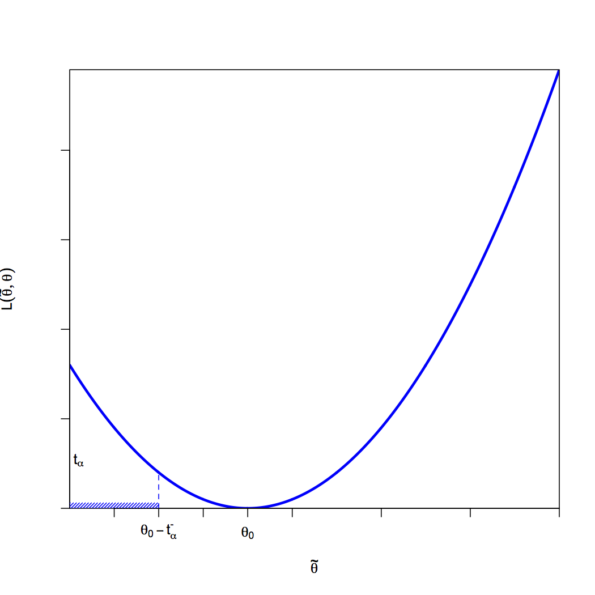

[](http://quantlet.de/)

## [](http://quantlet.de/) **MSEEX0811** [](http://quantlet.de/)

```yaml

Name of QuantLet: MSEEX0811


Published in: 'Modern Mathematical Statistics: Exercise and Solution'


Description: 'Illustrates the proof of an alpha-level LR test. Output is a plot.'


Keywords: 'parameter, likelihood-ratio-test, likelihood ratio, likelihood, testing, test, plot'


See also:


Author: Wolfgang Karl Härdle, Vladimir Panov, Ye Hua


Submitted:

 Wed, June 29 2011 by Maria Osipenko

Example: 'Illustrates the proof of an alpha-level LR test.'
```



### R Code
```r

# Close windows and clear variables
graphics.off()
rm(list = ls(all = T))

theta = seq(-3, 8, 0.01)
y = 5 * (theta - 1)^2

plot(theta, y, "l", xlab = expression(paste("", tilde(theta))), lwd = 3, ylab = expression(paste("", L(tilde(theta), theta))), 
    col = "blue", cex.axis = 1.5, xaxs = "i", yaxs = "i", labels = F)
abline(h = 20, col = "blue", lty = 2, lwd = 1)

y = seq(0, 20, 0.01)
theta = -1

points(-1, 20, "h", col = "blue", lty = 2, lwd = 1)
axis(side = 1, at = c(-1), labels = expression(paste("", theta[0] - t[alpha]^{
    "-"
})))
axis(side = 1, at = c(1), labels = expression(paste("", theta[0])))
text(-2.8, 27, expression(paste("", t[alpha])))
polygon(c(-3, -3, -1, -1), c(3, 0, 0, 3), density = c(40), angle = c(45), border = NA, col = "blue") 

```

automatically created on 2018-05-28