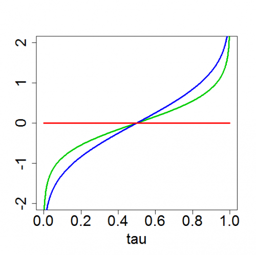
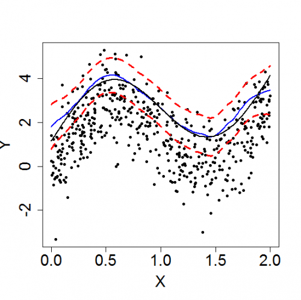

[](http://quantlet.de/)

## [](http://quantlet.de/) **MSEconfexpectile0.95** [](http://quantlet.de/)

```yaml

Name of QuantLet: MSEconfexpectile0.95

Published in: 'Modern Mathematical Statistics : Exercises and Solutions'

Description: 'Constructs the confidence bands for an expectile curve with a confidence level of 0.95.'

Keywords: 'confidence-interval, expectile, quantile, regression, plot, visualization'

See also: 'SPMfesdensities, SPMkernel, SPMkernelregression, TERES_ExpectileQuantileDiff, TERES_ExpectileQuantileDiffMulti, TXTSimulation, TXTSimulationAttention, TXTSimulationBS'

Author: Mengmeng Guo, Maria Osipenko

Submitted: Thu, January 16 2014 by Maria Osipenko

Example: 'The estimated and the true expectile curve with 95% confidence bands.'
```





### R Code
```r

# install.packages('VGAM') install.packages('expectreg') install.packages('mboost') install.packages('KernSmooth')


rm(list = ls(all = TRUE))
library(KernSmooth)
library(VGAM)
library(expectreg)
library(mboost)

##### ---------------------------------- functions to estimate the local quantile regression
lprq_xx = function(x, y, h, tau = NA, xx) {
    # modified from lprq, s.t. we can specify where (xx) to estimate the quantiles, uses Gausian Kernel parameters:
    # x = explanatory variable; y = dependent variable; h = bandwidth; tau = quantile level, if unspecified the function estimates
    # RANDOM quantiles; xx=grid points WHERE to estimate
    fv = xx
    dv = xx
    for (i in 1:length(xx)) {
        z = x - xx[i]
        wx = dnorm(z/h)
        if (tau == NA) {
            r = rq(y ~ z, weights = wx, tau = runif(1), ci = FALSE)
        } else {
            r = rq(y ~ z, weights = wx, tau = tau, ci = FALSE)
        }
        fv[i] = r$coef[1]
        dv[i] = r$coef[2]
    }
    list(xx = xx, fv = fv, dv = dv)
}

local.expectile = function(y, x, z, h, q) {
    # function to compute local expectile; uses Epanechnikov kernel parameters: x=explanatory variable; y= dependent variable;
    # z = grid points; h = bandwidth, q = expectile level
    x_0      = rep(1, length(x) * length(z))
    dim(x_0) = c(length(x), length(z))
    x_1      = t(x_0)
    x0       = x * x_0  #grid points
    w1       = 0.5
    y0       = y * x_0  #initial weight
    y11      = 0.5 * y * x_1  #initial expectile value
    x1       = z * x_1
    x10      = x0 - t(x1)
    x11      = kernel(x10/h)  # Epanechnikov kernel weights
    it       = 1  # count for the iterations, total 100 iterations
    dw1      = 1  # convergence indicator, if dw1=0 convergence is achieved
    while (dw1 != 0 & it < 100) {
        v1  = ((y0 < t(y11)) - 2 * q * (y0 < t(y11)) + q) * x11
        v2  = y * v1
        f1  = apply(v1, 2, mean)
        f2  = apply(v2, 2, mean)
        f3  = f2/f1
        w01 = w1
        w1  = as.vector(ifelse(y0 > t(f3 * x_1), q, 1 - q))
        dw1 = sum(w1 != w01, na.rm = TRUE)  # if the weights do not change the algorithm has converged
        y1  = f3
        y11 = f3 * x_1
        it  = it + 1
    }
    return(y1)  # returns the local expectile of y
}

kernelq = function(u) {
    dnorm(u, mean = 0, sd = 1)
}  # returns Gausian kernel weights

kernel = function(x) {
    0.75 * (1 - x^2) * (abs(x) <= 1)
}


##### -------------------------------------- Simulation of the data and estimation of the expectile parameters to be specified

coverate   = 0
area.cover = 0
B          = 500
n          = 500   # number of observation
q          = 0.95  # expectile level
h          = 0.2   # bandwidth
alpha      = 0.05  # confidence level
gridn      = n     # the length of grid
cc         = 1/4   # kernel constant

set.seed(10 * 3)  # fix the random generator seed
x       = runif(n, 0, 2)
y       = 1.5 * x + 2 * sin(pi * x) + rnorm(n)  # simulate the data with standard normal noise
e_theor = 1.5 * x + 2 * sin(pi * x) + enorm(q)  # compute the theoretical expectile

z     = x
v     = x  # v for the nonparametric part
bound = c(0, 1)
yuv   = sort(v)  # sort the grid points
yur   = y[order(v)]  # reorder y wrt the grid

##### -------------------------------------- the expectile and confidence bands for tau=0.95 and alpha = 0.05

h12    = (0.5 * (1 - 0.5)/dnorm(qnorm(0.5))^2)^0.2 * h
b2     = max(h/sd(yuv) * sd(yur), h12^5/(h)^3, h/10)
lambda = 1/(2 * sqrt(pi))                                                       # this is for normal kernel, if quartic kernel, value is 5/7
delta  = 1/4                                                                    #log(h)/log(n)\t\t\t\t\t\t    # compute the constants
dn     = sqrt(2 * delta * log(n)) + (2 * delta * log(n))^(-1/2) * log(cc/2/pi)

# compute binned approximation to the kernel density estimate
fxd    = bkde(yuv, gridsize = gridn, range.x = c(min(z), max(z)))

values = local.expectile(y, x, z, h, q)
yy1    = y - values[order(x)]

# compute binned approximation to the kernel density estimate
fx_yy    = bkde(sort(yy1), gridsize = gridn, range.x = c(min(yy1), 0))
delta_yy = c(min(yy1), fx_yy$x)
sigma    = q^2 * mean(yy1^2) + (1 - 2 * q) * sum(yy1^2 * fx_yy$y * diff(delta_yy))
f_x      = ecdf(yy1)
fx       = q + (1 - 2 * q) * f_x(0)

bandt    = (fxd$y)^(1/2) * fx
cn       = log(2) - log(abs(log(1 - alpha)))

# determine the corridor
band       = (n * h)^(-1/2) * sqrt(lambda * sigma) * bandt^(-1) * (dn + cn * (2 * delta * log(n))^(-1/2))
coverate1  = min(e_theor[order(x)] <= values[order(x)] + band, e_theor[order(x)] >= values[order(x)] - band)
coverate   = coverate + coverate1
area.cover = mean(band) + area.cover

##### --------------------------------------- plots

X11()
# plot the theoretical and the estimated expectile curves and the 95% confidens bands
plot(x, y, type = "p", pch = 20, ylim = c(min(y), max(y)), xlab = "X", ylab = "Y", cex.lab = 1.8, cex.axis = 1.8)
lines(sort(x), values[order(x)], col = "blue", lwd = 2, type = "l")
lines(sort(x), e_theor[order(x)], lwd = 2, col = 1)
lines(sort(x), values[order(x)] - band, col = "red", lty = 2, lwd = 3)
lines(sort(x), values[order(x)] + band, col = "red", lty = 2, lwd = 3)


X11()
# Plot the quantile and expectile curves for standard normal distribution.
x  = seq(1e-04, 0.9999, length = 1000)
y1 = enorm(x)
y2 = qnorm(x)
y  = cbind(y1, y2, 0)
matplot(x, y, type = "l", lty = 1, cex.axis = 2, cex.lab = 2, xlab = "tau", ylab = "", lwd = 3, col = c(3, 4, 2), ylim = c(-2, 2)) 

```

automatically created on 2018-05-28