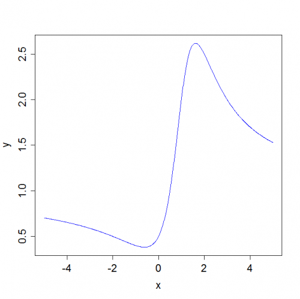

[](http://quantlet.de/)

## [](http://quantlet.de/) **MSEfcauchy** [](http://quantlet.de/)

```yaml

Name of QuantLet: MSEfcauchy

Published in: 'Modern Mathematical Statistics: Exercises and Solutions'

Description: 'Plots the critical region of the Neyman-Pearson test within a specific interval if p is a density of the standard Cauchy distribution.'

Keywords: plot, Cauchy distribution, distribution, function, visualization 

Author: Wolfgang K. Haerdle, Weining Wang, Shih Kang Chao

Submitted: Mon, September 27 2010 by Maria Osipenko

Example: 'Plots y = f(x) where x1 and x2 (x1 < x2) are two solutions of the quadratic equation.'
```



### R Code
```r

x = seq(-5, 5, 0.01)
y = (1 + x^2)/(1 + ((x - 1)^2))
plot(x, y, "l", col = "blue", cex.lab = 1.5, cex.axis = 1.5) 

```

automatically created on 2018-05-28