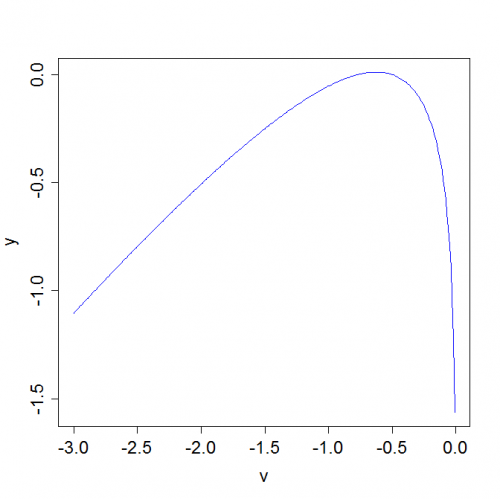

[](http://quantlet.de/)

## [](http://quantlet.de/) **MSEklcanparam** [](http://quantlet.de/)

```yaml

Name of QuantLet: MSEklcanparam 

Published in: 'Modern Mathematical Statistics: Exercises and Solutions'

Description: 'Draws a plot of the Kullback-Leibler function for a canonical parameter.'

Keywords: plot, Kullback-Leibler, function, canonical-parameter, parameter

Author: Wolfgang K. Haerdle, Weining Wang, Shih Kang Chao

Submitted: Mon, September 27 2010 by Maria Osipenko

Example: 'Plot of the Kullback-Leibler function f(theta) for a canonical parameter.' 
```



### R Code
```r

v = seq(-3, -0.01, 0.01)
y = 0.8 * v - 0.5 * log(-0.5/v) + 0.4
plot(v, y, "l", col = "blue", cex.lab = 1.5, cex.axis = 1.5) 

```

automatically created on 2018-05-28